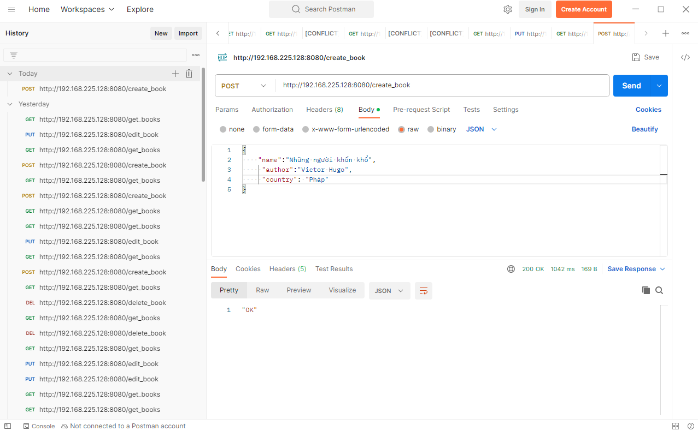
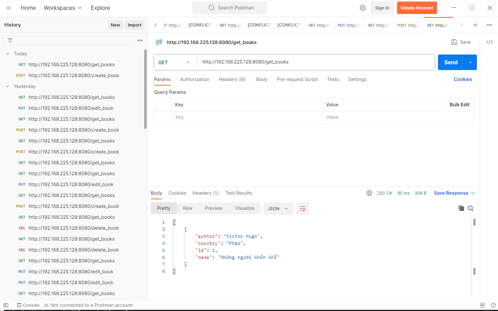
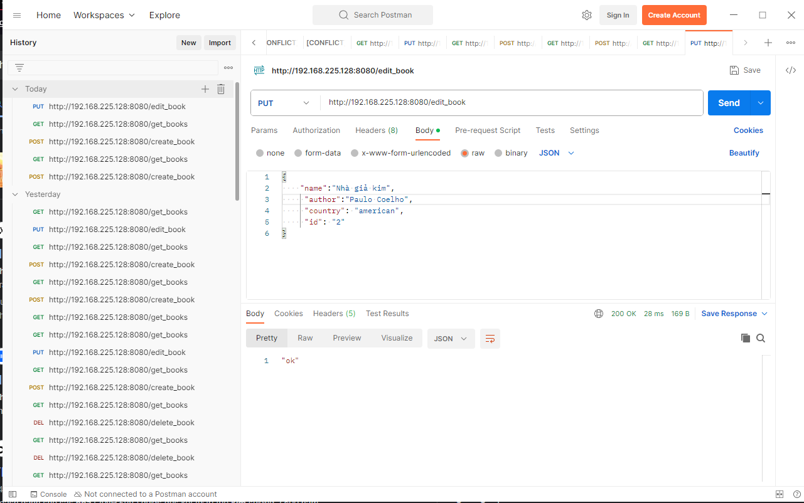
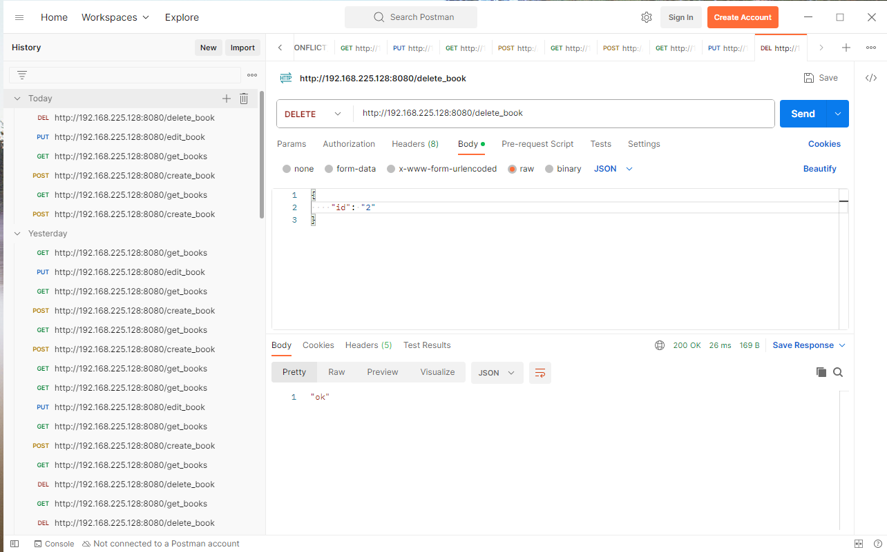

Chạy command "docker compose up -d" để chạy API

Create

Get

Put

Delete

=======================================================
Tạo file inventory.txt để cấu hình ip, user_ssh, password

chạy command "ansible-playbook -i inventory.txt ./ansible/docker.yaml".
